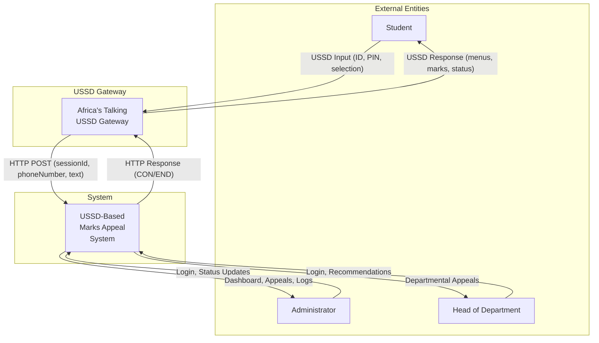
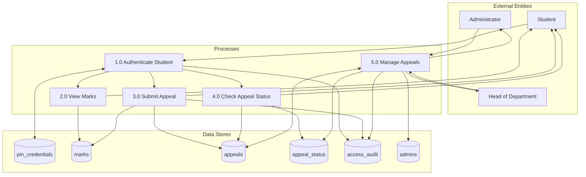
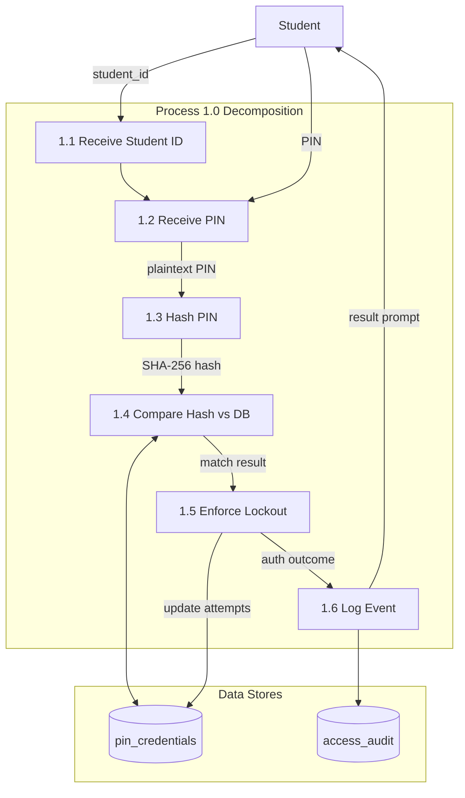
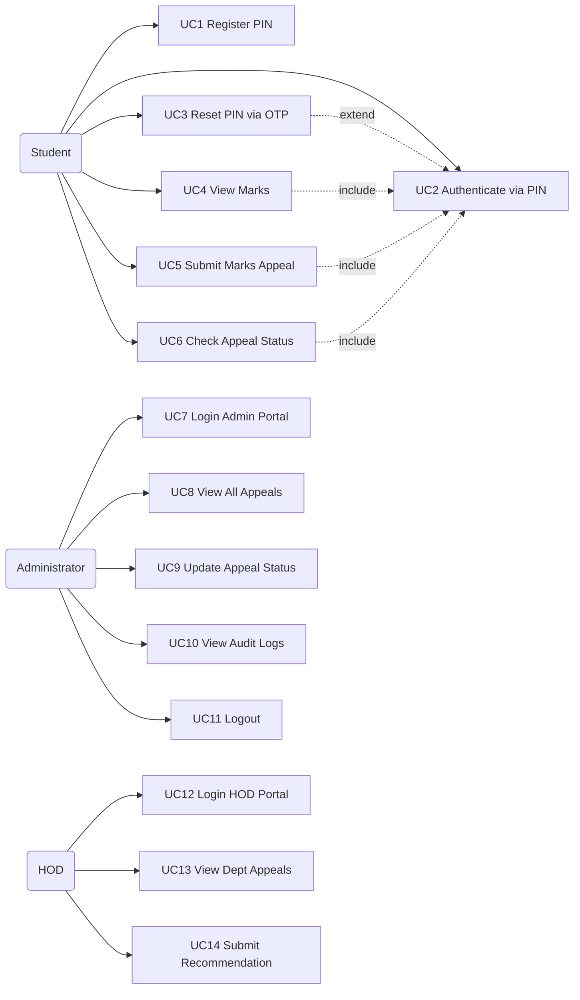
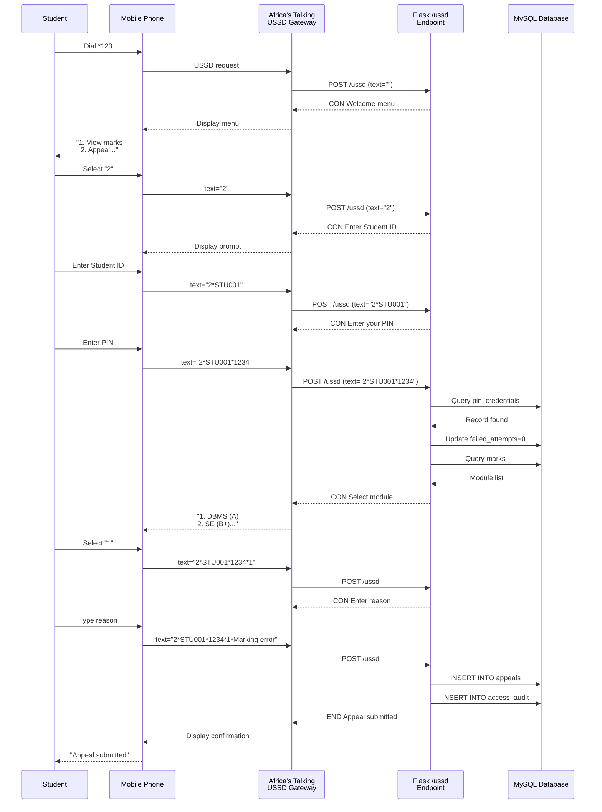
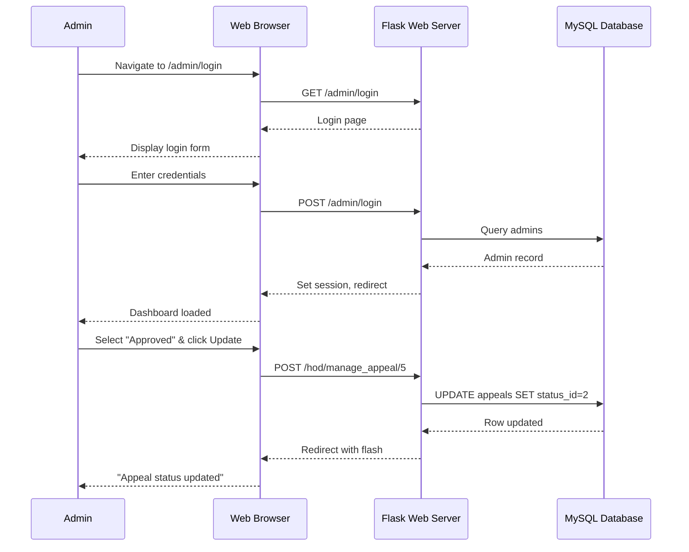
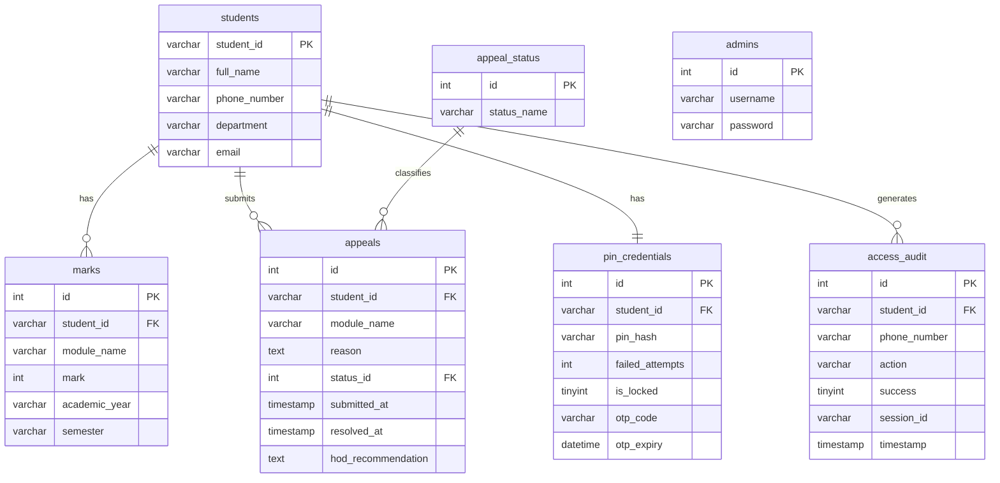

# ULK Marks Appeal System — System Diagrams

> Generated for Chapter Four: System Analysis, Design and Implementation

---

## 1. Context Diagram (DFD Level 0)



---

## 2. Data Flow Diagram — Level 1



---

## 3. Data Flow Diagram — Level 2 (Authenticate Student)



---

## 4. Use Case Diagram



---

## 5. Sequence Diagram — Student Submits an Appeal



---

## 6. Sequence Diagram — Administrator Updates Appeal Status



---

## 7. Entity Relationship Diagram (ERD)



---

## 8. Physical Data Model (Relational Schema)

```text
appeal_db
│
├── students
│   ├── id              INT          PK AUTO_INCREMENT
│   ├── student_id      VARCHAR(20)  NOT NULL UNIQUE
│   ├── full_name       VARCHAR(100) NOT NULL
│   ├── phone_number    VARCHAR(15)  NOT NULL
│   ├── department      VARCHAR(100) NOT NULL
│   ├── email           VARCHAR(100) NULL
│   └── created_at      TIMESTAMP    DEFAULT CURRENT_TIMESTAMP
│
├── admins
│   ├── id              INT          PK AUTO_INCREMENT
│   ├── username        VARCHAR(50)  NOT NULL UNIQUE
│   ├── password        VARCHAR(255) NOT NULL  (SHA-256)
│   └── created_at      TIMESTAMP    DEFAULT CURRENT_TIMESTAMP
│
├── marks
│   ├── id              INT          PK AUTO_INCREMENT
│   ├── student_id      VARCHAR(20)  FK → students.student_id
│   ├── module_name     VARCHAR(100) NOT NULL
│   ├── mark            INT          NOT NULL
│   ├── academic_year   VARCHAR(20)  NULL
│   └── semester        VARCHAR(20)  NULL
│
├── appeal_status
│   ├── id              INT          PK AUTO_INCREMENT
│   └── status_name     VARCHAR(50)  NOT NULL
│       (Rows: Pending, Approved, Rejected)
│
├── appeals
│   ├── id              INT          PK AUTO_INCREMENT
│   ├── student_id      VARCHAR(20)  FK → students.student_id
│   ├── module_name     VARCHAR(100) NOT NULL
│   ├── reason          TEXT         NULL
│   ├── status_id       INT          NOT NULL DEFAULT 1  FK → appeal_status.id
│   ├── submitted_at    TIMESTAMP    DEFAULT CURRENT_TIMESTAMP
│   ├── resolved_at     TIMESTAMP    NULL
│   └── hod_recommendation TEXT     NULL
│
├── pin_credentials
│   ├── id              INT          PK AUTO_INCREMENT
│   ├── student_id      VARCHAR(20)  NOT NULL UNIQUE FK → students.student_id
│   ├── pin_hash        VARCHAR(64)  NOT NULL  (SHA-256)
│   ├── failed_attempts INT          DEFAULT 0
│   ├── is_locked       TINYINT(1)   DEFAULT 0
│   ├── otp_code        VARCHAR(10)  NULL
│   ├── otp_expiry      DATETIME     NULL
│   └── last_updated    TIMESTAMP    DEFAULT CURRENT_TIMESTAMP ON UPDATE
│
└── access_audit
    ├── id              INT          PK AUTO_INCREMENT
    ├── student_id      VARCHAR(20)  FK → students.student_id
    ├── phone_number    VARCHAR(15)  NULL
    ├── action          VARCHAR(100) NULL
    ├── success         TINYINT(1)   NULL
    ├── session_id      VARCHAR(100) NULL
    └── timestamp       TIMESTAMP    DEFAULT CURRENT_TIMESTAMP
```

---

## Table Summary

| Diagram | File | Description |
|---------|------|-------------|
| DFD Level 0 | `dfd_level0.dot` | Context diagram — system as single process |
| DFD Level 1 | `dfd_level1.dot` | 5 primary processes with data stores |
| DFD Level 2 | `dfd_level2_auth.dot` | Authentication sub-process decomposition |
| Use Case | `use_case.puml` | 3 actors, 14 use cases with relationships |
| Sequence (Appeal) | `sequence_appeal.puml` | Full student appeal flow via USSD |
| Sequence (Admin) | `sequence_admin.puml` | Admin login and status update flow |
| ERD | `erd.puml` | 7 entities with keys and relationships |
